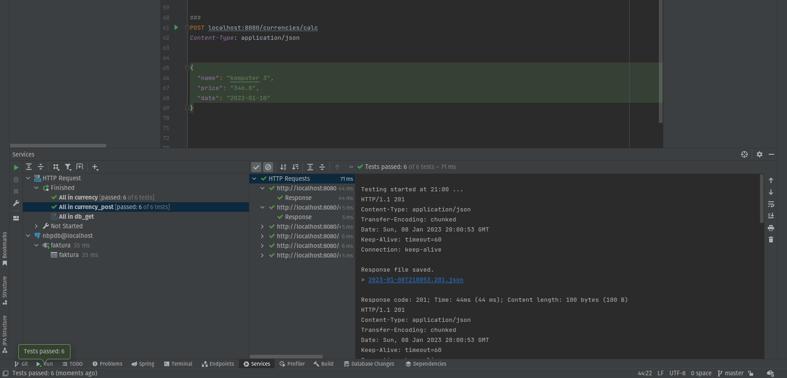

<h1>Aplikacja Przeliczająca Walute z USD na PLN</h1>
<hr>
<h3>Omówienie:</h3>
<p>Aby przetestować aplikacje będą nam potrzebne odpowiednie aplikacje. Z webowego Swagger-UI niestety nie mogłem skorzystać, gdyż nie chciał działać prawidołowo.</p>
<p>Potrzebny zatem będzie nam Docker w celu utworzenia obrazu naszej bazy danych, oraz opcjonalnie Postman do zapytań naszych endpointów. Utworzone są dwa pliki
w katalogu http, które można uruchomić i zasilić naszą baze danych oraz wyciągnąć z niej wszytkie dane.</p>

Oczywiście aby uruchomić dockera wystarczy wejść w konsoli do folderu /docker i następnie uruchomić komende:
```aidl
docker-compose up -d 
```

Przyładowe zaciągnięcie danych do bazy uruchamiając plik currency_post.http



Również możemy skorzystać z Postmana


Jeżeli użytkownik chcę zobaczyć całą zawartość bazy danych może skorzystać z powyższych metod lub wpisać odpowiedni endpoint w przeglądarkę:


Dane w bazie 


Baza będzie tworzyła się za każdym razem na nowo, jeżeli chcielibyśmy to zmienić wystarczy w "application.properties" zmienić z "create" na "validate" po wcześniejszym jej uruchomieniu z "create" i zasileniem danymi